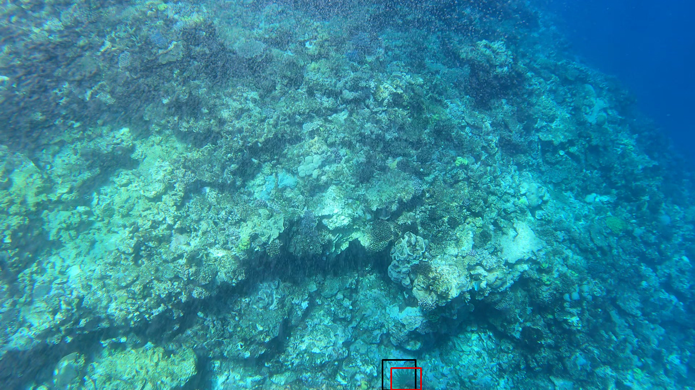
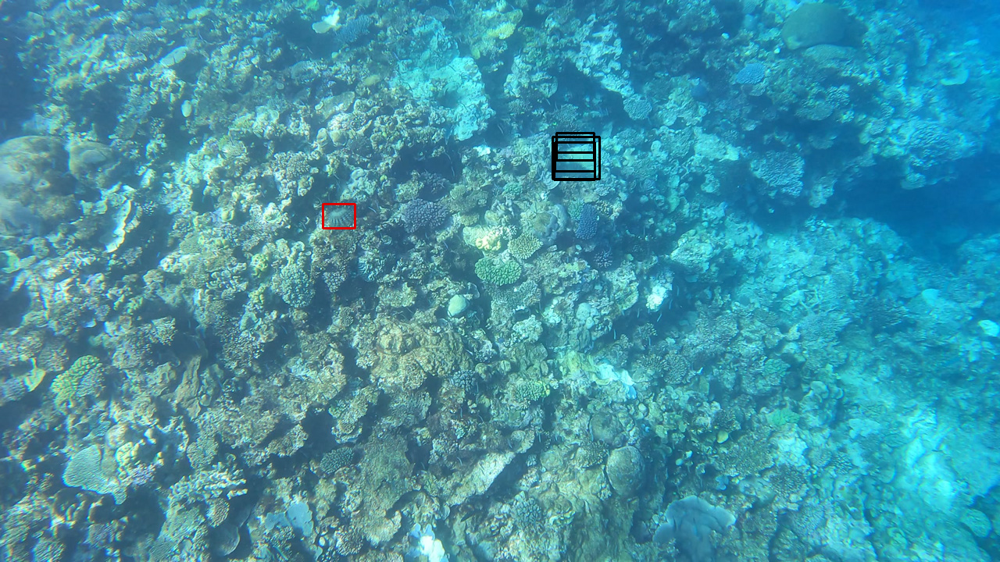
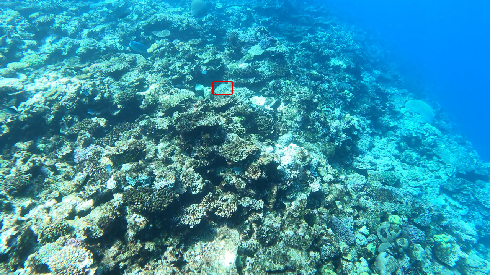

# Object_Detection

Working on the kaggle COTS dataset. Creating an algorithm to recognise the COTS in great Barrier Reef using the Tensorflow Object Detection API. THe plan is to compare different types of models (Faster-RCNN, SSD and YOLO models) and visualise the predictions and see which one works better.

# Faster RCNN

This model uses a two-step approach, first step identifies the region where the object is expected to be found, the next step is to detect objects in the identified region.  After training we see that the model does not find all of the instances and generates a lot of false positives items, but it still manages to identify some of the COTS. See examples below.

We note that quite often to identify the presence of the COTS in the video sequence it need to be quite close to the camera

Examples of visualsation:

True positives

 

False positives

No detection (depends on the detection threshold)

For training steps, see scripts/training/Training_cleaned.ipynb

# EfficientDet

EfficientDet uses the architecture calles Single shot detection model. Single shot detection model utilises a fully convolutional approach without the region proposal stage, as in Faster RCNN. SSD has two components a backbone and a SSD head. Backbone is trained by classification algortihm and SSD layers are stacked on top of it.

Note that the repository is still "Work in progress"