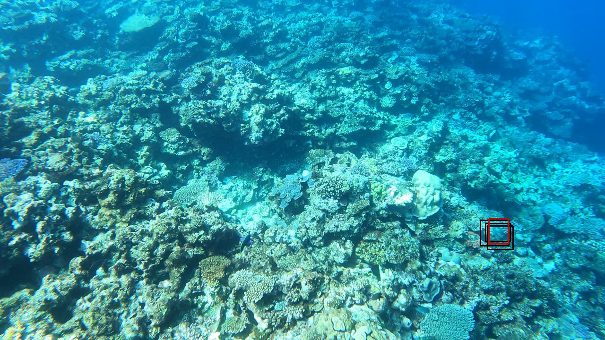

# Object_Detection

Working on the kaggle COTS dataset. Creating an algorithm to recognise the COTS in great Barrier Reef using the Tensorflow Object Detection API. THe plan is to compare different types of models (Faster-RCNN, SSD and YOLO models) and visualise the predictions and see which one works better.

# Faster RCNN

After training we see that the model does not find all of the instances and generates a lot of false positives items, but it still manages to identify some of the COTS. See examples below.

We note that quite often to identify the presence of the COTS in the video sequence it need to be quite close to the camera

Examples of visualsation:

True positives

 

False positives

No detection (depends on the detection threshold)

